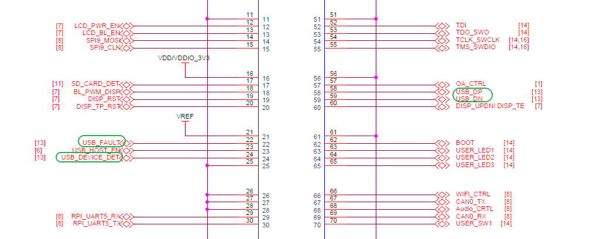
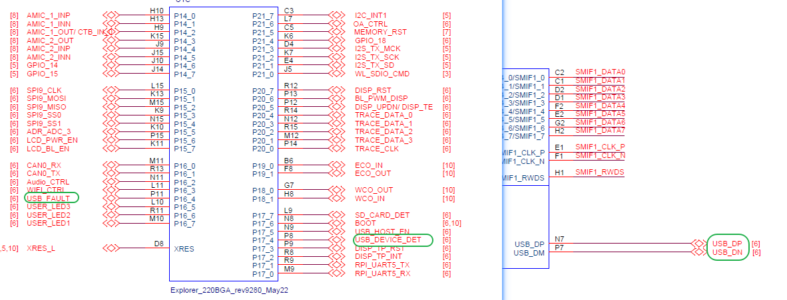
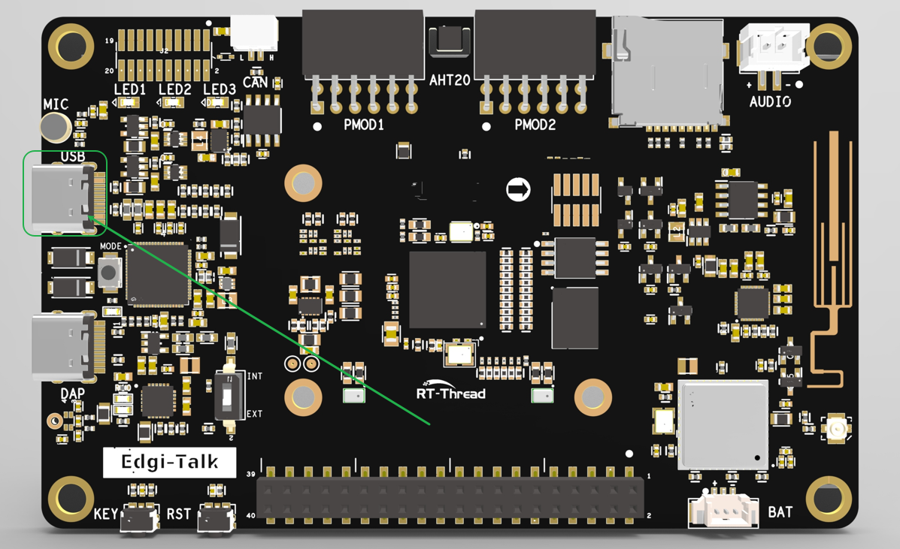

# Edgi-Talk_CDC_Echo 示例工程

**中文** | [**English**](./README.md)

## 简介

本示例工程基于 **Edgi-Talk 平台**，演示 **USB CDC（虚拟串口）回显功能**，运行在 **RT-Thread 实时操作系统 (M33核)** 上。
通过本工程，用户可以快速体验 USB CDC 设备通信机制，并验证数据回显功能，为后续 USB 通信和多核应用开发提供参考。

## 硬件说明
### USB接口

### BTB座子

### MCU接口

### 实物图位置


## 软件说明

* 工程基于 **Edgi-Talk** 平台开发。
* 示例功能包括：

  * USB CDC 设备初始化
  * 虚拟串口数据回显
* 工程结构清晰，便于理解 USB 设备驱动在 **M33 核** 上的运行方式。

## 使用方法

### 编译与下载

1. 打开工程并完成编译。
2. 使用 **板载下载器 (DAP)** 将开发板的 USB 接口连接至 PC。
3. 通过编程工具将生成的固件烧录至开发板。

### 运行效果

* 烧录完成后，开发板上电即可运行示例工程。
* 用户需在串口命令行手动输入：

```
cdc_sample
```
* 系统输出如下启动信息：
```
 \ | /
- RT -     Thread Operating System
 / | \     5.0.2 build Sep  8 2025 09:57:30
 2006 - 2022 Copyright by RT-Thread team
Hello RT-Thread
This core is cortex-m33
msh >cdc_sample
****************** PSOC Edge MCU: CDC echo using emUSB-device******************

```
* 在 PC 上使用任意串口工具连接开发板的 USB 虚拟串口。
1. 打开 PC 串口调试工具，连接开发板的虚拟串口（波特率任意）。
2. 在串口工具中输入一段字符串，并 **以换行符 `\n` 结尾** 发送。
3. 开发板会将接收到的完整字符串回显至串口终端。
```
> hello
hello
> 12345
12345
```

## 注意事项

* **回显触发条件**：
  只有当接收数据的最后一个字符为 **换行符 `\n`** 时，才会触发一次完整回显。
  如果输入未包含 `\n`，数据会暂存于缓冲区，不会立即回显。


* 如需修改工程的 **图形化配置**，请使用以下工具打开配置文件：

```
tools/device-configurator/device-configurator.exe
libs/TARGET_APP_KIT_PSE84_EVAL_EPC2/config/design.modus
```

* 修改完成后保存配置，并重新生成代码。

## 启动流程

系统启动顺序如下：

```
+------------------+
|   Secure M33     |
|   (安全内核启动)  |
+------------------+
          |
          v
+------------------+
|       M33        |
|   (非安全核启动) |
+------------------+
          |
          v
+-------------------+
|       M55         |
|  (应用处理器启动) |
+-------------------+
```

⚠️ 请严格按照以上顺序烧写固件，否则系统可能无法正常运行。

---

* 若示例工程无法正常运行，建议先编译并烧录 **Edgi-Talk\_M33\_S\_Template** 工程，确保初始化与核心启动流程正常，再运行本示例。
* 若要开启 M55，需要在 **M33 工程** 中打开配置：

  ```
  RT-Thread Settings --> 硬件 --> select SOC Multi Core Mode --> Enable CM55 Core
  ```

