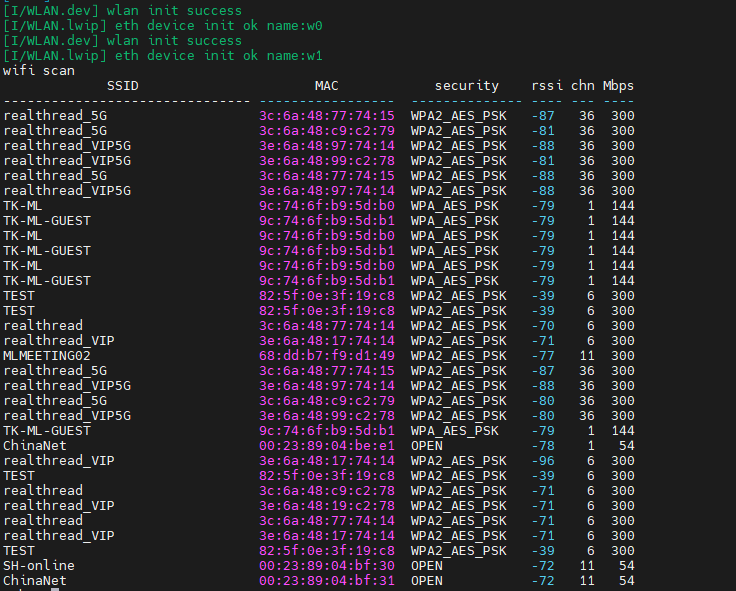
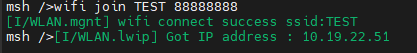
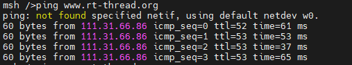
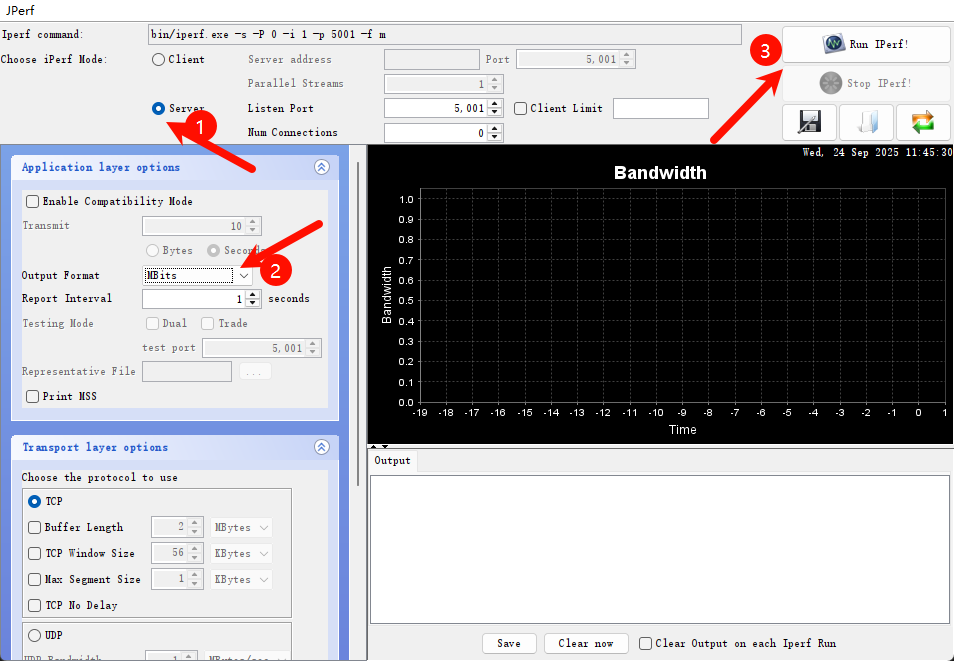

# Edgi-Talk_WIFI 示例工程

**中文** | [**English**](./README.md)

## 简介

本示例工程基于 **Edgi-Talk 平台**，演示 **WIFI功能**，运行在 **RT-Thread 实时操作系统 (M55 核)** 上。
通过本工程，用户可以快速体验 WIFI的联网功能，并验证WIFI模块的接口，为后续WIFI的开发提供参考。

## 硬件说明
### WIFI接口

### BTB座子

### MCU接口

## 软件说明

* 工程基于 **Edgi-Talk** 平台开发。

* 示例功能包括：

  * WIFI的扫描
  * WIFI的连接
  * Iperf测速
  
* 工程结构清晰，便于理解WIFI驱动和 RT-Thread 系统的配合使用。

## 使用方法

### 编译与下载

1. 打开工程并完成编译。
2. 使用 **板载下载器 (DAP)** 将开发板的 USB 接口连接至 PC。
3. 通过编程工具将生成的固件烧录至开发板。

### 运行效果

* 烧录完成后，开发板上电即可运行示例工程。
* 系统会自动初始化 WIFI设备。
* 用户可在 **串口终端**使用以下命令连接WIFI：

```
wifi scan
```

```
wifi join 名称 密码
```

```
ping www.rt-thread.org
```


* 网络连接完成后，可使用 iperf 进行性能测试。
* 在 packages\netutils-latest\tools 目录下提供了 jperf.rar 测速工具。
* 将其解压后，双击其中的 .bat 文件，即可启动工具，界面如下图所示：



* 在开发板终端输入以下命令（其中 电脑的 IP 请替换为实际地址），即可开始测速：

```
iperf -c <电脑的IP>
```

### 注意事项

* 可以使用电脑开热点进行测试，频段最好为2.4G。

## 启动流程

系统启动顺序如下：

```
+------------------+
|   Secure M33     |
|   (安全内核启动) |
+------------------+
          |
          v
+------------------+
|       M33        |
|   (非安全核启动) |
+------------------+
          |
          v
+-------------------+
|       M55         |
|  (应用处理器启动) |
+-------------------+
```

⚠️ 请严格按照以上顺序烧写固件，否则系统可能无法正常运行。

---

* 若示例工程无法正常运行，建议先编译并烧录 **Edgi-Talk\_M33\_S\_Template** 工程和 **Edgi-Talk\_M33\_Template** 工程，确保初始化与核心启动流程正常，再运行本示例。
* 若要开启 M55，还需要在 **Edgi-Talk\_M33\_Template工程** 中打开配置：

```
RT-Thread Settings --> 硬件 --> select SOC Multi Core Mode --> Enable CM55 Core
```

