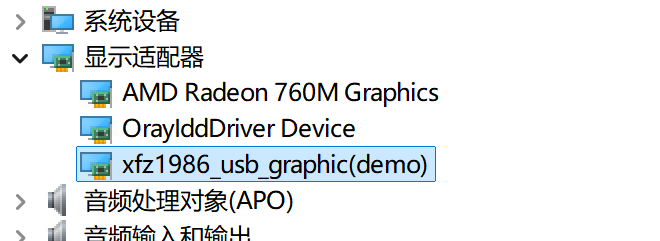

# Edgi_Talk_M55_USB_D CherryUSB USB Extend Screen Example

[**中文**](./README_zh.md) | **English**

## Overview

This project integrates **CherryUSB** on the **M55 core** of the Edgi-Talk board. It is prepared for **USB device mode**, uses the Infineon **DWC2** IP, and implements a **Windows USB extend screen**.

## Default Configuration

* `RT_USING_CHERRYUSB = y`
* `RT_CHERRYUSB_DEVICE = y`
* `RT_CHERRYUSB_DEVICE_SPEED_HS = y`
* `RT_CHERRYUSB_DEVICE_DWC2_INFINEON = y`
* Device template: **none** (user application)
* Display transport: vendor interface with RGB565 frames

## Build and Flash

1. Build the project in RT-Thread Studio or with SCons.
2. Flash the firmware via KitProg3 (DAP).
3. Connect the Type-C USB port for device enumeration.

## Configuration (Switching Modes)

Open RT-Thread Studio and go to:

```
RT-Thread Settings -> USB -> CherryUSB
```

* **Device mode**: enable `RT_CHERRYUSB_DEVICE`, select device IP under **CHERRYUSB_DEVICE_IP** (default: `RT_CHERRYUSB_DEVICE_DWC2_INFINEON`).
* **Device classes**: enable class drivers and select a template under **Select usb device template**.

If an IP/class requires extra parameters, edit:

* `libraries/Common/board/ports/usb/usb_config.h`

## Windows IDD Driver

Windows Indirect Display Driver (IDD) provides a user-mode driver model for monitors that are not connected to a traditional GPU output.

Reference: https://learn.microsoft.com/windows-hardware/drivers/display/indirect-display-driver-model-overview

This driver is based on: https://github.com/chuanjinpang/win10_idd_xfz1986_usb_graphic_driver_display

If you need to modify it, download and rebuild it yourself.

### How to use

1. Install `resources\USB_Graphic\xfz1986_usb_graphic_250224_rc_sign.exe`.
2. After installation, a new display appears under Display adapters.

  

### Notes

* The driver communicates via a vendor interface, supports multiple resolutions and formats, and is controlled by string descriptors. See: https://github.com/chuanjinpang/win10_idd_xfz1986_usb_graphic_driver_display/blob/main/README.md
* The driver supports Windows 10 and Windows 11 only.

## Startup Sequence

The M55 core depends on the M33 boot flow. Flash in this order:

```
+------------------+
|   Secure M33     |
|  (Secure Core)   |
+------------------+
          |
          v
+------------------+
|       M33        |
| (Non-Secure Core)|
+------------------+
          |
          v
+-------------------+
|       M55         |
| (Application Core)|
+-------------------+
```

## Notes

* This project targets the M55 core in USB device mode.
* For host mode, see [projects/Edgi_Talk_CherryUSB/Edgi_Talk_M55_USB_H/README.md](../Edgi_Talk_M55_USB_H/README.md).
* For M33 device mode, see [projects/Edgi_Talk_CherryUSB/Edgi_Talk_M33_USB_D/README.md](../Edgi_Talk_M33_USB_D/README.md).
* If the M55 example does not run, flash **Edgi_Talk_M33_Blink_LED** first.
* Enable CM55 in the M33 project:

  ```
  RT-Thread Settings -> Hardware -> select SOC Multi Core Mode -> Enable CM55 Core
  ```
