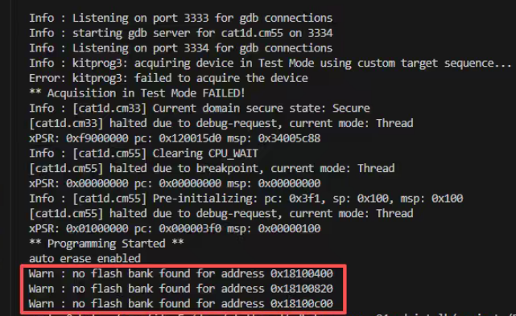
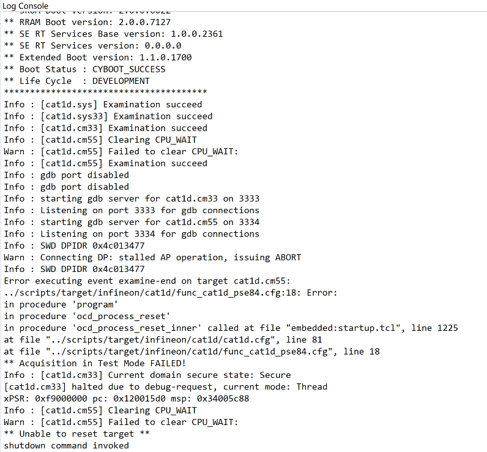
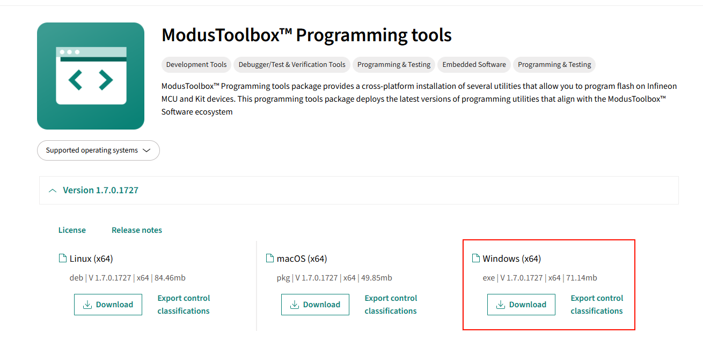
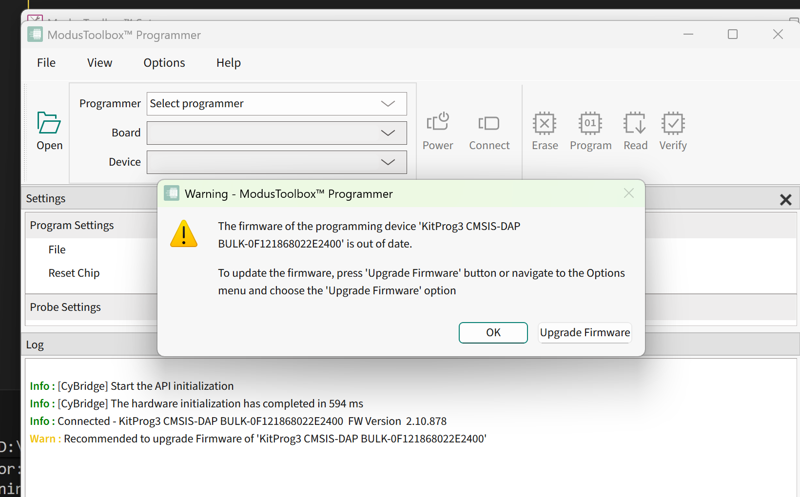
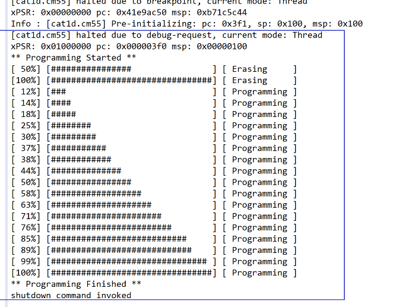
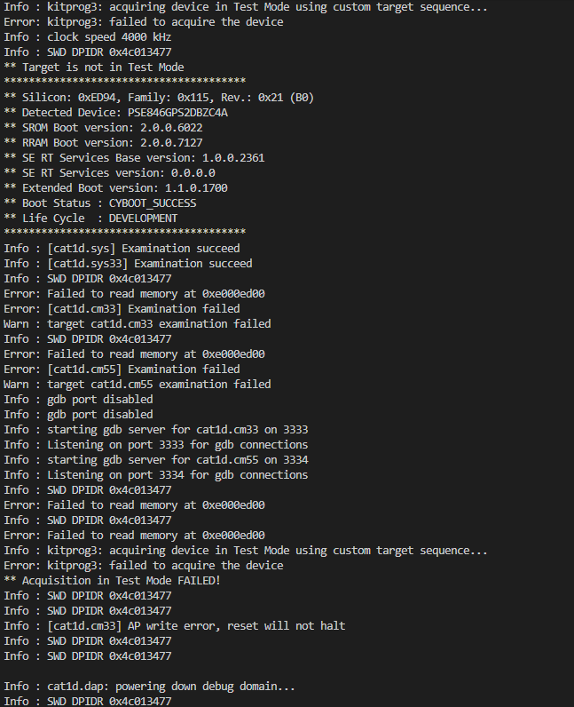
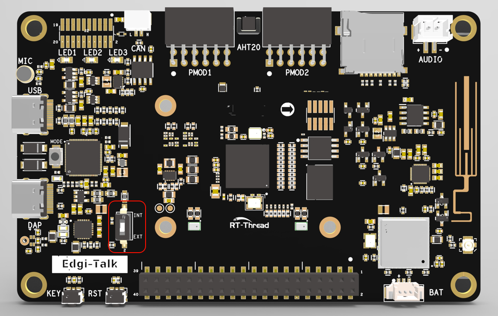

# 常见问题解答（FAQ）

本文档收集了用户在使用过程中遇到的常见问题及解决方案。

## 一、烧录

### Q1. 烧录固件出错

 

 

**解决方法：**

首先下载如下链接的上位机，我们需要进行固件更新：

[ModusToolbox™ Programming tools - Infineon Developer Center](https://softwaretools.infineon.com/tools/com.ifx.tb.tool.modustoolboxprogtools)

 

如果提示如下的警告，说明你开发板上面的DAP-Link固件需要更新，才可以烧录固件，这时需要点击 **Upgrade Fimeware** 按钮

 

更新完成后，重新上电开发板，然后即可下载程序了

   

### Q2. 为什么烧录了Edgi_Talk_M55_XXX工程后，没有现象？

**解决方法：**

芯片启动顺序如下：

```
+------------------+
|   Secure M33     |
|   (安全内核启动)  |
+------------------+
          |
          v
+------------------+
|       M33        |
|   (非安全核启动)  |
+------------------+
          |
          v
+-------------------+
|       M55         |
|  (应用处理器启动)  |
+-------------------+
```

⚠️ 请严格按照以上顺序烧写固件，否则系统可能无法正常运行。

- 若示例工程无法正常运行，建议先编译并烧录 **Edgi_Talk_M33_Blink_LED** 工程，确保初始化与核心启动流程正常，再运行本示例。
- 若要开启 M55，需要在 **M33 工程** 中打开配置：

```
RT-Thread Settings --> 硬件 --> select SOC Multi Core Mode --> Enable CM55 Core
```


### Q3.烧录固件出错


**解决方法：**


1. 将 BOOT 配置切换至 **INT**
2. 重启开发板
3. 下载程序
4. 将 BOOT 配置切换至 **EXT**
5. 再次重启开发板
